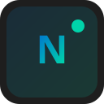

# Noder

**Real-time collaborative IDE** by **JagX** & **JRILICENSE**



## Brand

- **Mark** — network nodes forming **N** + live pulse (`assets/logo.svg`)
- **Wordmark** — **Noder** + LIVE (`assets/wordmark.svg`)
- **App icons** — generated for Windows / macOS / Linux:

```bash
pip install pillow
npm run generate:icons   # → assets/icon.png + icon.ico
```

## Why Noder (vs plain editors)

| Capability | Noder |
|------------|--------|
| Real-time collab | Built-in (Yjs), not an extra install |
| AI | Multi-provider BYOK (OpenAI, Anthropic, Grok, OpenRouter, NVIDIA) + **Insert into editor** |
| Terminal | Real system shell (node-pty or process shell) |
| Git | Stage / commit / **push / pull** + blame |
| Marketplace | Install extensions locally |
| UX | Activity bar, workspace search, zen mode, command palette history |

## Quick start

```bash
git clone https://github.com/JagX-JRILICENSE/Noder.git
cd Noder
npm install
npm run electron:dev
```

## Shortcuts

- `Ctrl+Shift+P` Command Palette
- `Ctrl+Shift+A` AI Assistant
- `Ctrl+K Z` Zen mode (toggle via palette: View)
- `Ctrl+`` Terminal

## Build

```bash
npm run build:win   # generates icons then packages
```

## License

MIT
